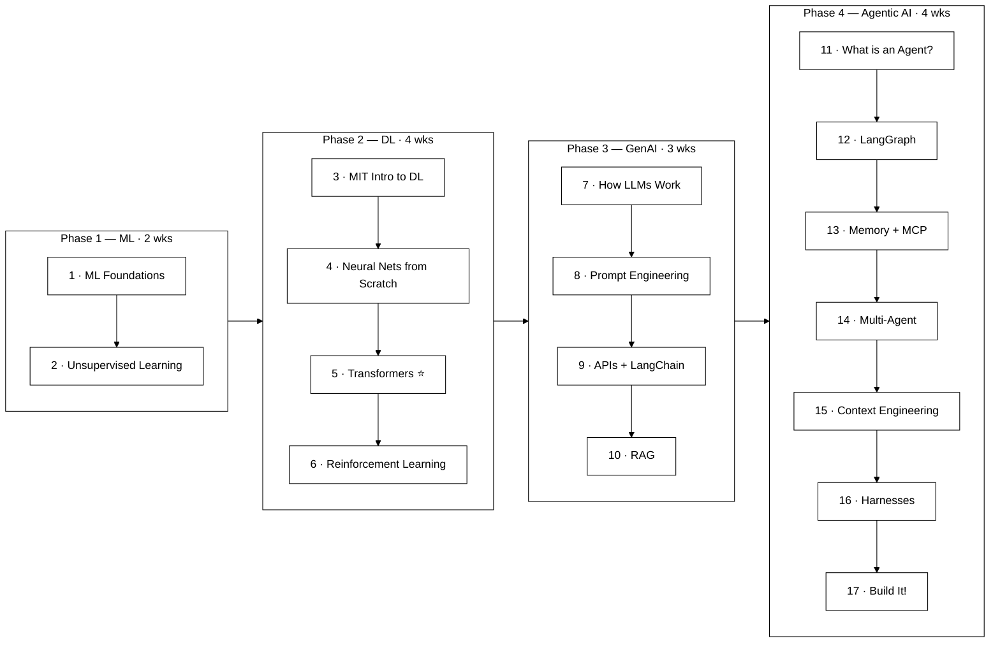

# Agentic AI for Beginners 2026
### ML → Deep Learning → GenAI → Agentic AI — Free, Essentials Only

> The bare minimum path to building AI agents. 17 steps. All free. April 2026.

---

## From Zero to Agents — 17 Steps

> **Rule:** Finish each step before moving on. Don't skip Transformers (Step 5) or RL (Step 6) — everything after depends on them.

---

## Phase 1 — Machine Learning (~2 weeks)

### Step 1 — Machine Learning Foundations (Supervised Learning)
*How machines learn from data. KNN, Decision Trees, model evaluation, scikit-learn.*

| | |
|---|---|
| Watch | [Sebastian Raschka — Intro to ML (Parts 1–4)](https://sebastianraschka.com/blog/2021/ml-course.html) — all video lectures with YouTube links |
| Syllabus | [STAT 451 Course Page](https://sebastianraschka.com/teaching/stat451-fs2021/) |
| Build | Classify Iris or Titanic dataset with KNN + Decision Tree in scikit-learn. Compare models with cross-validation |

> **Part 1: Introduction**
> L01 – Course Overview, Intro to ML · L02 – Supervised Learning & KNN
>
> **Part 2: Computational Foundations** *(skip if you already code in Python)*
> L03 – Python · L04 – Scientific Python (NumPy) · L05 – Scikit-learn
>
> **Part 3: Tree-Based Methods**
> L06 – Decision Trees · L07 – Ensemble Methods (Bagging, Random Forests, Boosting)
>
> **Part 4: Model Evaluation**
> L08 – Overfitting · L09 – Confidence Intervals · L10 – Cross-Validation & Model Selection · L11 – Algorithm Selection · **L12 – Evaluation & Performance Metrics**
>
> **Optional — Parts 5 & 6:** Dimensionality Reduction (L13–L14) & Bayesian Methods (L15–L16). Good to know but not required for the agentic path.

---

### Step 2 — Unsupervised Learning
*Clustering, anomaly detection, dimensionality reduction (PCA). How machines find patterns without labels.*

| | |
|---|---|
| Watch | [StatQuest — K-Means Clustering](https://www.youtube.com/watch?v=4b5d3muPQmA) (free, visual, beginner-friendly) |
| Watch | [StatQuest — PCA Step-by-Step](https://www.youtube.com/watch?v=FgakZw6K1QQ) (22 min — the best PCA explainer on YouTube, 2M+ views) |
| Read | [Stanford CS229 — Unsupervised Learning Cheatsheet](https://stanford.edu/~shervine/teaching/cs-229/cheatsheet-unsupervised-learning/) |
| Build | Cluster customer data with K-Means in scikit-learn. Visualize clusters with PCA |

---

## Phase 2 — Deep Learning (~4 weeks)

### Step 3 — Intro to Deep Learning (MIT 6.S191)
*What deep learning is, how neural networks work, optimizers, loss functions, training.*

| | |
|---|---|
| Watch | [MIT 6.S191 — Lecture 1: Intro to Deep Learning](https://www.youtube.com/watch?v=II4giR4vOOo&list=PLtBw6njQRU-rwp5__7C0oIVt26ZgjG9NI&index=1) · [Course site](https://introtodeeplearning.com) |
| Visualize | [3Blue1Brown — Neural Networks Ch.1–4](https://www.3blue1brown.com/topics/neural-networks): [What is a Neural Network?](https://www.youtube.com/watch?v=aircAruvnKk) → [Gradient Descent](https://www.youtube.com/watch?v=IHZwWFHWa-w) → [Backpropagation](https://www.youtube.com/watch?v=Ilg3gGewQ5U) → [Backprop Calculus](https://www.youtube.com/watch?v=tIeHLnjs5U8) |

---

### Step 4 — Neural Networks from Scratch
*Neurons, backpropagation, training. Understand it by building it.*

| | |
|---|---|
| Watch | [Andrej Karpathy — Neural Nets: Zero to Hero](https://www.youtube.com/playlist?list=PLAqhIrjkxbuWI23v9cThsA9GvCAUhRvKZ) — start with [Micrograd](https://www.youtube.com/watch?v=VMj-3S1tku0) |
| Code | [Karpathy — Makemore MLP](https://www.youtube.com/watch?v=TCH_1BHY58I) → [Backprop Ninja](https://www.youtube.com/watch?v=q8SA3rM6ckI) |

---

### Step 5 — Transformers & Attention (DO NOT SKIP)
*Self-attention, Q/K/V, positional encoding. Everything in Phase 3 & 4 builds on this.*

| | |
|---|---|
| Watch | [MIT 6.S191 — RNNs, Transformers & Attention](https://www.youtube.com/watch?v=GvezxUdLrEk&list=PLtBw6njQRU-rwp5__7C0oIVt26ZgjG9NI&index=4) |
| Visualize | [3Blue1Brown — Transformers](https://www.youtube.com/watch?v=wjZofJX0v4M) · [Attention](https://www.youtube.com/watch?v=eMlx5fFNoYc) |
| Read | [Jay Alammar — The Illustrated Transformer](https://jalammar.github.io/illustrated-transformer/) |
| Build | [Karpathy — Let's Build GPT from Scratch](https://www.youtube.com/watch?v=kCc8FmEb1nY) |

---

### Step 6 — Reinforcement Learning
*How agents learn from rewards. Policies, value functions, Q-learning, deep RL. The foundation behind RLHF and agent decision-making.*

| | |
|---|---|
| Watch | [MIT 6.S191 — Reinforcement Learning](https://www.youtube.com/watch?v=to-lHJfK4pw&list=PLtBw6njQRU-rwp5__7C0oIVt26ZgjG9NI&index=7) · [Course site](https://introtodeeplearning.com) |
| Build | Train a simple agent (CartPole or similar) using Q-learning in OpenAI Gymnasium |

---

## Phase 3 — Generative AI (~3 weeks)

### Step 7 — How LLMs Work
*Pretraining, tokenization, next-token prediction, scaling laws.*

| | |
|---|---|
| Watch | [Karpathy — Deep Dive into LLMs like ChatGPT](https://www.youtube.com/watch?v=7xTGNNLPyMI) (3.5 hrs) |
| Read | [Jay Alammar — The Illustrated GPT-2](https://jalammar.github.io/illustrated-gpt2/) · [How GPT3 Works](https://jalammar.github.io/how-gpt3-works-visualizations-animations/) |

---

### Step 8 — Prompt Engineering
*Zero-shot, few-shot, chain-of-thought, system prompts, structured output.*

| | |
|---|---|
| Course | [DeepLearning.AI — Prompt Engineering for Developers](https://www.deeplearning.ai/short-courses/chatgpt-prompt-engineering-for-developers/) (~1.5 hrs, free) |
| Practical | [Karpathy — How I Use LLMs](https://www.youtube.com/watch?v=EWvNQjAaOHw) (2 hrs) |

---

### Step 9 — LLM APIs + Building Apps
*Call LLMs from code. Function calling. Build your first LLM app with LangChain.*

| | |
|---|---|
| Course | [DeepLearning.AI — Building Systems with the ChatGPT API](https://www.deeplearning.ai/short-courses/building-systems-with-chatgpt/) (~1 hr, free) |
| Course | [DeepLearning.AI — LangChain for LLM App Development](https://www.deeplearning.ai/short-courses/langchain-for-llm-application-development/) (~2 hrs, free) |

---

### Step 10 — RAG (Retrieval-Augmented Generation)
*The #1 production pattern. Chunk → embed → retrieve → rerank → generate. 80% of RAG failures trace to ingestion/chunking, not the LLM.*

| | |
|---|---|
| Course | [DeepLearning.AI — Building & Evaluating Advanced RAG](https://www.deeplearning.ai/short-courses/building-evaluating-advanced-rag/) (~1.5 hrs, free) |
| Course | [DeepLearning.AI — Retrieval Augmented Generation (RAG)](https://www.deeplearning.ai/courses/retrieval-augmented-generation-rag/) (free, ~5 hrs — chunking, hybrid search, evaluation, deployment) |
| Read | [Anthropic — Contextual Retrieval](https://www.anthropic.com/news/contextual-retrieval) (reduced retrieval failures by 67%) |
| Read | [Google — Advanced RAG Techniques Codelab](https://codelabs.developers.google.com/codelabs/production-ready-ai-with-gc/8-advanced-rag-methods/advanced-rag-methods) (chunking, reranking, query transformation) |
| Read | [Weaviate — Advanced RAG Techniques](https://weaviate.io/blog/advanced-rag) (indexing, pre-retrieval, retrieval, post-retrieval optimization) |
| Embeddings | [Jay Alammar — The Illustrated Word2Vec](https://jalammar.github.io/illustrated-word2vec/) |
| Build | RAG app that answers questions from your own PDFs — LangChain + ChromaDB |

---

## Phase 4 — Agentic AI (~4 weeks)

### Step 11 — What is an AI Agent?
*Agent = LLM + Tools + Memory + Goal. The 5 workflow patterns + autonomous agents.*

| | |
|---|---|
| Read | [Lilian Weng — LLM Powered Autonomous Agents](https://lilianweng.github.io/posts/2023-06-23-agent/) (the definitive blueprint — Planning + Memory + Tool Use) |
| Read | [Anthropic — Building Effective Agents](https://www.anthropic.com/research/building-effective-agents) (5 workflow patterns: chaining, routing, parallelization, orchestrator-workers, evaluator-optimizer) |
| Read | [Andrew Ng — AI Agentic Design Patterns](https://www.deeplearning.ai/the-batch/how-agents-can-improve-llm-performance/) (free article) |
| Read | [LangChain — Workflows and Agents](https://docs.langchain.com/oss/python/langgraph/workflows-agents) (official docs — when to use workflows vs. agents) |
| Report | [LangChain — State of Agent Engineering 2026](https://www.langchain.com/state-of-agent-engineering) (1,300+ professionals surveyed — production patterns, model choices, barriers) |
| Course | [DeepLearning.AI — Functions, Tools & Agents with LangChain](https://www.deeplearning.ai/short-courses/functions-tools-agents-langchain/) (~2 hrs, free) |

---

### Step 12 — Build Agents with LangGraph
*Stateful agents, tool use, planning, ReAct loops.*

| | |
|---|---|
| Course | [LangChain Academy — Intro to LangGraph](https://academy.langchain.com/courses/intro-to-langgraph) (free, official — start here) |
| Follow-up | [DeepLearning.AI — AI Agents in LangGraph](https://www.deeplearning.ai/short-courses/ai-agents-in-langgraph/) (~3 hrs, free) |

---

### Step 13 — Memory + MCP
*Long-term agent memory. Model Context Protocol for connecting agents to real tools.*

| | |
|---|---|
| Course | [DeepLearning.AI — Long-Term Agentic Memory with LangGraph](https://www.deeplearning.ai/short-courses/long-term-agentic-memory-with-langgraph/) (free) |
| Course | [DeepLearning.AI — MCP: Build Rich-Context AI Apps with Anthropic](https://www.deeplearning.ai/short-courses/mcp-build-rich-context-ai-apps-with-anthropic/) (free) |

---

### Step 14 — Multi-Agent Systems
*Multiple specialized agents working together. CrewAI framework.*

| | |
|---|---|
| Course | [DeepLearning.AI — Multi AI Agent Systems with CrewAI](https://www.deeplearning.ai/short-courses/multi-ai-agent-systems-with-crewai/) (~3 hrs, free) |
| New | [DeepLearning.AI — A2A: The Agent2Agent Protocol](https://www.deeplearning.ai/short-courses/a2a-the-agent2agent-protocol/) (free) |

---

### Step 15 — Context Engineering
*After building single and multi-agent systems, this is the production skill. Orchestrating prompts + RAG + tool definitions + state/history + memory into the context window. This is what separates demo agents from production agents.*

| | |
|---|---|
| Read | [Karpathy on Context Engineering](https://x.com/karpathy/status/1937902205765607626) |
| Read | [Phil Schmid — The New Skill in AI is Context Engineering](https://www.philschmid.de/context-engineering) |
| Read | [Anthropic — Contextual Retrieval Cookbook](https://platform.claude.com/cookbook/capabilities-contextual-embeddings-guide) |

---

### Step 16 — Agent Harnesses (2026 Frontier)
*The harness wraps around a fixed LLM and manages context, tools, retries, reflection, and routing. Changing just the harness = 6x performance gap (Stanford).*

| | |
|---|---|
| Read | [Meta-Harness: End-to-End Optimization of Model Harnesses (Stanford, 2026)](https://arxiv.org/abs/2603.28052) |
| Read | [Natural-Language Agent Harnesses (2026)](https://arxiv.org/abs/2603.25723) |
| Explainer | [The Neuron — Meta-Harness Explainer](https://www.theneuron.ai/explainer-articles/meta-harness-is-automated-agent-engineering-the-next-frontier/) |

---

### Step 17 — Build a Real Agent (Final Project)

> **Starter:** ReAct agent — web search + question answering with citations
> **Intermediate:** Research agent (LangGraph) — plan → search → summarize → report
> **Advanced:** Multi-agent system — Researcher + Writer + Critic working together

---

## Appendix — 5 Viral Papers You Should Know (2023–2026)

| # | Paper | Year | Why It Matters | Link |
|---|---|---|---|---|
| 1 | **Attention Is All You Need** — Vaswani et al. | 2017 | The paper that started it all. Introduced the Transformer architecture. Every LLM is built on this. | [arxiv.org/abs/1706.03762](https://arxiv.org/abs/1706.03762) |
| 2 | **ReAct: Synergizing Reasoning and Acting in Language Models** — Yao et al. | 2023 | Defined the ReAct pattern (Reason + Act) — the backbone of how every modern AI agent works. | [arxiv.org/abs/2210.03629](https://arxiv.org/abs/2210.03629) |
| 3 | **Reflexion: Language Agents with Verbal Reinforcement Learning** — Shinn et al. | 2023 | Agents that reflect on their own failures and improve. Core pattern behind self-correcting agents. | [arxiv.org/abs/2303.11366](https://arxiv.org/abs/2303.11366) |
| 4 | **Meta-Harness: End-to-End Optimization of Model Harnesses** — Lee et al. (Stanford) | 2026 | Showed that changing the harness around a fixed LLM produces 6x performance gap. Harness > model. | [arxiv.org/abs/2603.28052](https://arxiv.org/abs/2603.28052) |
| 5 | **Natural-Language Agent Harnesses** — Pan et al. | 2026 | Introduced NLAHs — expressing harness behavior in editable natural language instead of code. | [arxiv.org/abs/2603.25723](https://arxiv.org/abs/2603.25723) |

> **Bonus — Must-Read Blog Post:**
> [Lilian Weng — LLM Powered Autonomous Agents (2023)](https://lilianweng.github.io/posts/2023-06-23-agent/) — The definitive blueprint: Planning + Memory + Tool Use. Written by OpenAI's Head of Safety Systems. Every agentic framework built since maps to this architecture. Still the single best starting point in 2026.

---

## All Links (Quick Copy)

| # | Resource | Link |
|---|---|---|
| 1 | Raschka — Intro to ML (video lectures) | https://sebastianraschka.com/blog/2021/ml-course.html |
| 1b | Raschka — STAT 451 Syllabus | https://sebastianraschka.com/teaching/stat451-fs2021/ |
| 2 | StatQuest — K-Means Clustering | https://www.youtube.com/watch?v=4b5d3muPQmA |
| 3 | StatQuest — PCA Step-by-Step | https://www.youtube.com/watch?v=FgakZw6K1QQ |
| 3b | Stanford CS229 — Unsupervised Learning Cheatsheet | https://stanford.edu/~shervine/teaching/cs-229/cheatsheet-unsupervised-learning/ |
| 4 | MIT 6.S191 — Lecture 1 (2026) | https://www.youtube.com/watch?v=II4giR4vOOo&list=PLtBw6njQRU-rwp5__7C0oIVt26ZgjG9NI&index=1 |
| 5 | MIT 6.S191 — Transformers (Lecture 4) | https://www.youtube.com/watch?v=GvezxUdLrEk&list=PLtBw6njQRU-rwp5__7C0oIVt26ZgjG9NI&index=4 |
| 5b | MIT 6.S191 — Reinforcement Learning (Lecture 7) | https://www.youtube.com/watch?v=to-lHJfK4pw&list=PLtBw6njQRU-rwp5__7C0oIVt26ZgjG9NI&index=7 |
| 6 | Karpathy — Zero to Hero | https://www.youtube.com/playlist?list=PLAqhIrjkxbuWI23v9cThsA9GvCAUhRvKZ |
| 7 | Karpathy — Micrograd | https://www.youtube.com/watch?v=VMj-3S1tku0 |
| 8 | Karpathy — Makemore MLP | https://www.youtube.com/watch?v=TCH_1BHY58I |
| 9 | Karpathy — Backprop Ninja | https://www.youtube.com/watch?v=q8SA3rM6ckI |
| 10 | Karpathy — Build GPT from Scratch | https://www.youtube.com/watch?v=kCc8FmEb1nY |
| 11 | Karpathy — Deep Dive into LLMs | https://www.youtube.com/watch?v=7xTGNNLPyMI |
| 12 | Karpathy — How I Use LLMs | https://www.youtube.com/watch?v=EWvNQjAaOHw |
| 13 | 3Blue1Brown — Neural Networks Series | https://www.3blue1brown.com/topics/neural-networks |
| 14 | 3Blue1Brown — Transformers | https://www.youtube.com/watch?v=wjZofJX0v4M |
| 15 | 3Blue1Brown — Attention | https://www.youtube.com/watch?v=eMlx5fFNoYc |
| 16 | Jay Alammar — Illustrated Transformer | https://jalammar.github.io/illustrated-transformer/ |
| 17 | Jay Alammar — Illustrated GPT-2 | https://jalammar.github.io/illustrated-gpt2/ |
| 18 | Jay Alammar — How GPT3 Works | https://jalammar.github.io/how-gpt3-works-visualizations-animations/ |
| 19 | Jay Alammar — Illustrated Word2Vec | https://jalammar.github.io/illustrated-word2vec/ |
| 20 | DeepLearning.AI — Prompt Engineering | https://www.deeplearning.ai/short-courses/chatgpt-prompt-engineering-for-developers/ |
| 21 | DeepLearning.AI — Building Systems with ChatGPT API | https://www.deeplearning.ai/short-courses/building-systems-with-chatgpt/ |
| 22 | DeepLearning.AI — LangChain for LLM Apps | https://www.deeplearning.ai/short-courses/langchain-for-llm-application-development/ |
| 23 | DeepLearning.AI — Advanced RAG | https://www.deeplearning.ai/short-courses/building-evaluating-advanced-rag/ |
| 23b | DeepLearning.AI — RAG Full Course | https://www.deeplearning.ai/courses/retrieval-augmented-generation-rag/ |
| 23c | Anthropic — Contextual Retrieval | https://www.anthropic.com/news/contextual-retrieval |
| 23d | Anthropic — Contextual Retrieval Cookbook | https://platform.claude.com/cookbook/capabilities-contextual-embeddings-guide |
| 23e | Google — Advanced RAG Codelab | https://codelabs.developers.google.com/codelabs/production-ready-ai-with-gc/8-advanced-rag-methods/advanced-rag-methods |
| 23f | Weaviate — Advanced RAG Techniques | https://weaviate.io/blog/advanced-rag |
| 24 | Lilian Weng — LLM Powered Autonomous Agents | https://lilianweng.github.io/posts/2023-06-23-agent/ |
| 25 | Anthropic — Building Effective Agents | https://www.anthropic.com/research/building-effective-agents |
| 26 | Andrew Ng — Agentic Design Patterns | https://www.deeplearning.ai/the-batch/how-agents-can-improve-llm-performance/ |
| 27 | LangChain — Workflows and Agents | https://docs.langchain.com/oss/python/langgraph/workflows-agents |
| 28 | LangChain — State of Agent Engineering 2026 | https://www.langchain.com/state-of-agent-engineering |
| 29 | DeepLearning.AI — Functions, Tools & Agents | https://www.deeplearning.ai/short-courses/functions-tools-agents-langchain/ |
| 30 | LangChain Academy — Intro to LangGraph | https://academy.langchain.com/courses/intro-to-langgraph |
| 31 | DeepLearning.AI — AI Agents in LangGraph | https://www.deeplearning.ai/short-courses/ai-agents-in-langgraph/ |
| 32 | DeepLearning.AI — Long-Term Agentic Memory | https://www.deeplearning.ai/short-courses/long-term-agentic-memory-with-langgraph/ |
| 33 | DeepLearning.AI — MCP with Anthropic | https://www.deeplearning.ai/short-courses/mcp-build-rich-context-ai-apps-with-anthropic/ |
| 34 | DeepLearning.AI — CrewAI Multi-Agent | https://www.deeplearning.ai/short-courses/multi-ai-agent-systems-with-crewai/ |
| 35 | DeepLearning.AI — A2A Protocol | https://www.deeplearning.ai/short-courses/a2a-the-agent2agent-protocol/ |
| 36 | Karpathy — Context Engineering (tweet) | https://x.com/karpathy/status/1937902205765607626 |
| 37 | Phil Schmid — Context Engineering Guide | https://www.philschmid.de/context-engineering |
| 38 | Meta-Harness (Stanford, 2026) | https://arxiv.org/abs/2603.28052 |
| 39 | Natural-Language Agent Harnesses (2026) | https://arxiv.org/abs/2603.25723 |
| 40 | The Neuron — Meta-Harness Explainer | https://www.theneuron.ai/explainer-articles/meta-harness-is-automated-agent-engineering-the-next-frontier/ |
| 41 | ReAct Paper (Yao et al., 2023) | https://arxiv.org/abs/2210.03629 |
| 42 | Reflexion Paper (Shinn et al., 2023) | https://arxiv.org/abs/2303.11366 |
| 43 | Attention Is All You Need (2017) | https://arxiv.org/abs/1706.03762 |
